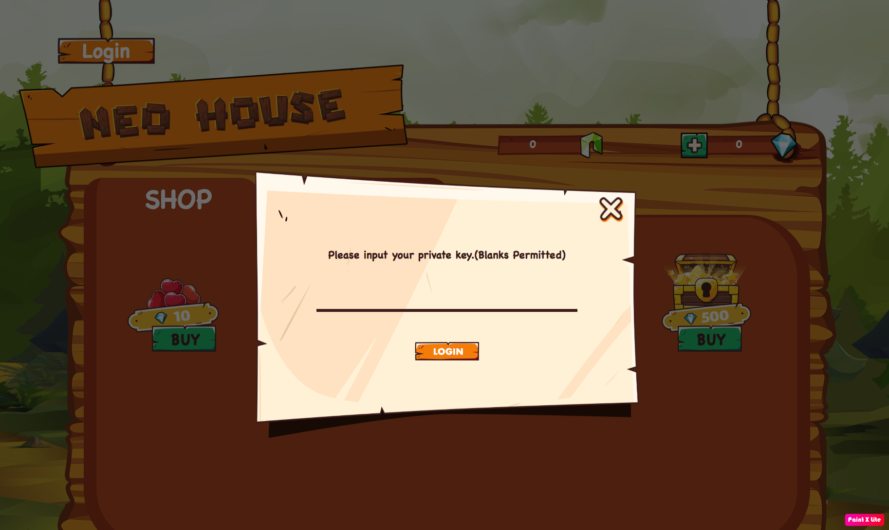
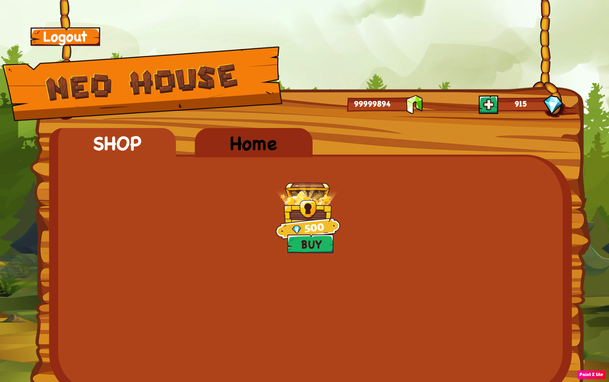
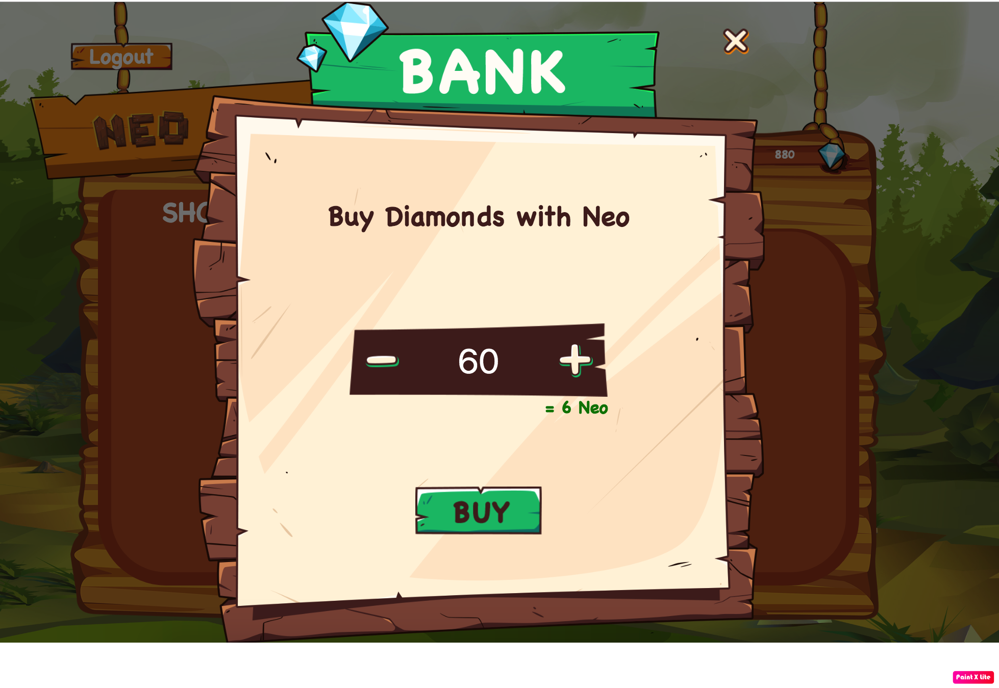
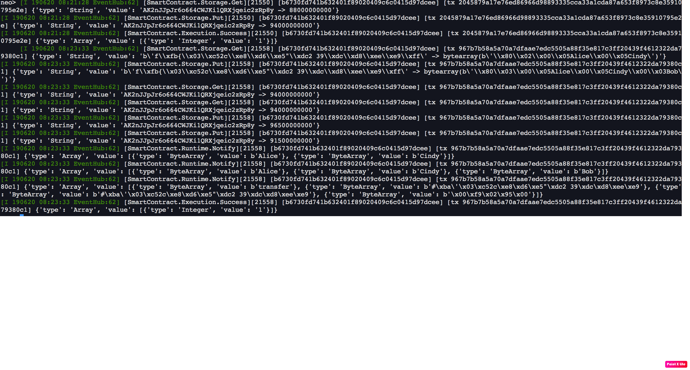
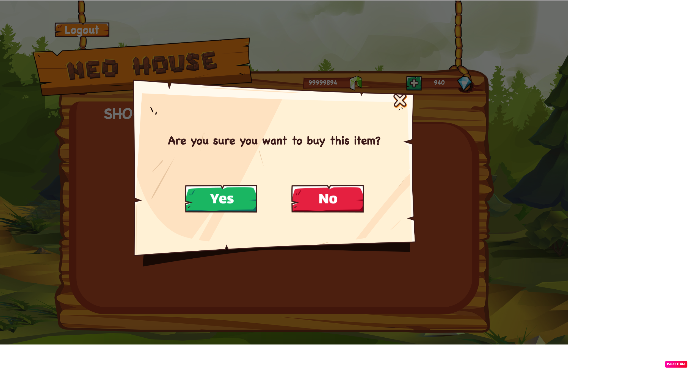
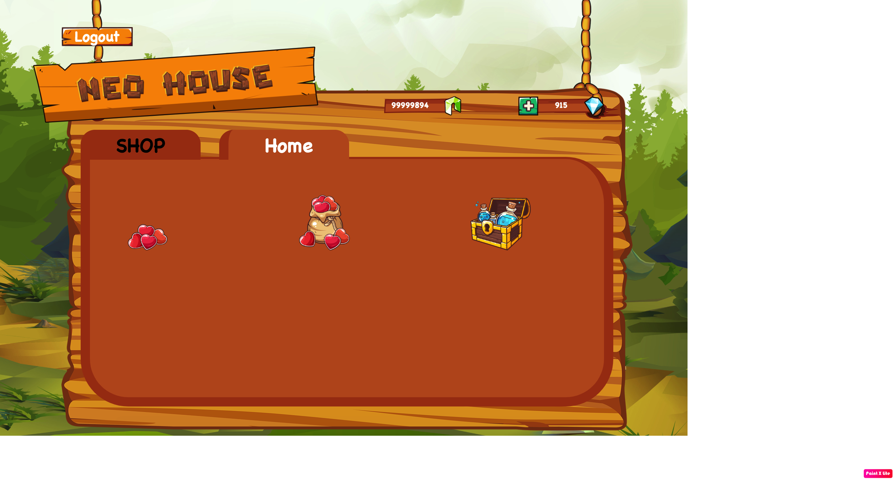

# dApp Demo

1. Firstly, we need to login to app by using your private key
To get your private key go to wallet and run command `neo> wallet export wif {address}`
Example: 
```
neo> wallet export wif AK2nJJpJr6o664CWJKi1QRXjqeic2zRp8y
[wallet password]> **********
WIF: KxDgvEKzgSBPPfuVfw67oPQBSjidEiqTHURKSDL1R7yGaGYAeYnr
neo>
```
We get WIF = KxDgvEKzgSBPPfuVfw67oPQBSjidEiqTHURKSDL1R7yGaGYAeYnr to login to dApp

2. To Login to dApp, click on Login button and fill in WIF (private key):


After login, you will see NEO and Diamond you have in your wallet, if you want to buy some diamonds click on (+) icon to buy.


Buy more diamond


After click buy you can see new invocation transaction on blockchain explorer or in neo-python wallet logs


3. Now let's buy some items you want, when you first time login to dapp, in your tab (Home tab) you don't have any items.
Click buy items and Yes to buy your item.



After buying, Item is moved to home tab (your bank). You also see transaction log on wallet of transaction on blockchain explorer


Your buying will stay forever on blockchain, you can check and reload it any time.
